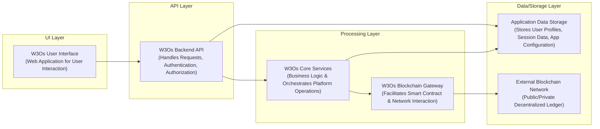

# W3Os

## Overview
- W3Os is a comprehensive framework designed to simplify decentralized application (dApp) development.
- It provides an operating system-like abstraction for interacting with Web3 ecosystems.
- The framework offers a suite of tools and standardized components for building robust dApps.
- It aims to reduce complexity and accelerate development cycles for blockchain-based solutions.

## Business Problem
- Developing dApps is complex due to fragmented protocols, varying blockchain interfaces, and security concerns.
- Lack of a unified framework leads to increased development time and inconsistent user experiences.
- Interoperability between different blockchain networks and services remains a significant challenge.
- High barrier to entry for developers new to the Web3 space, hindering innovation.

## Key Capabilities
- **Decentralized Identity Management**: Secure user authentication and authorization across dApps.
- **Smart Contract Abstraction Layer**: Simplified interaction with various smart contracts.
- **Cross-Chain Communication Toolkit**: Facilitates seamless data and value transfer between blockchains.
- **Decentralized Storage Integration**: Tools for interacting with IPFS, Arweave, and similar systems.
- **Real-time Blockchain Event Subscriptions**: Efficient monitoring and reaction to on-chain events.
- **Developer CLI & SDK**: Command-line interface and software development kit for rapid prototyping.
- **Wallet Integration Services**: Support for various Web3 wallets and authentication methods.
- **Modular Component Library**: Reusable UI and logic components for common dApp functionalities.

## Tech Stack
- Cloud: Cloud-agnostic deployment patterns for infrastructure components.
- Backend: TypeScript, Node.js, GraphQL (for indexing/gateway services).
- Frontend: TypeScript, React.
- Data: IPFS, Arweave (for decentralized content storage), PostgreSQL (for off-chain indexing/metadata).
- AI/ML: N/A (Future integration points for decentralized AI networks).

## Architecture Flow
1. User interacts with a dApp frontend built using W3Os components.
2. Frontend calls W3Os SDK methods to perform Web3 operations.
3. W3Os SDK handles authentication, wallet interactions, and request signing.
4. SDK routes requests to appropriate smart contracts on the blockchain or decentralized storage.
5. Blockchain network executes contract logic and updates state, or decentralized storage returns data.
6. W3Os SDK receives transaction confirmations or data.
7. SDK processes responses and propagates results back to the frontend.

## Repository Structure
```
.
├── src/
│   ├── core/
│   ├── modules/
│   ├── contracts/
│   └── index.ts
├── examples/
├── docs/
├── tests/
├── scripts/
├── .github/
├── package.json
├── tsconfig.json
└── README.md
```

## Local Setup
1. Clone the repository: `git clone https://github.com/ramamurthy-540835/w3os.git`
2. Navigate to the project directory: `cd w3os`
3. Install dependencies: `npm install`
4. Build the project: `npm run build`
5. Run tests: `npm test`
6. Explore examples: `npm run start:example`

## Deployment
1. Ensure all tests pass: `npm test`
2. Build the production-ready distribution: `npm run build`
3. Publish to NPM (for library distribution): `npm publish`
4. For dApps using W3Os, deploy smart contracts to chosen blockchain networks.
5. Deploy frontend application to a static hosting service or IPFS.
## Architecture

A modular platform enabling interaction with and development of Web3 applications and services..



For a standalone preview, see [docs/architecture.html](docs/architecture.html).

### Key Architectural Aspects:
* A client-side web application provides the primary user interface for the W3Os platform.
* A robust backend API handles all incoming user requests, manages authentication, and authorizes access to core services.
* Centralized core services orchestrate complex business logic and manage interactions with both traditional databases and blockchain components.
* A dedicated blockchain gateway ensures secure and efficient communication with external decentralized networks and smart contracts.
