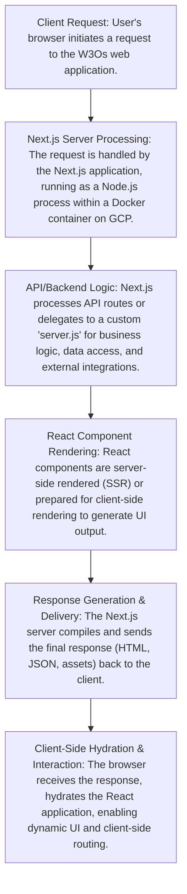

# W3Os

## Overview
W3Os is a modern web application project built with Next.js, designed for rapid development and scalable frontend solutions. This repository provides a robust foundation for creating high-performance, server-rendered React applications, leveraging TypeScript for enhanced developer experience and code maintainability. It integrates key web development themes such as Next.js, React, and TypeScript to deliver a powerful frontend framework.
[Explore the repository on GitHub](https://github.com/ramamurthy-540835/w3os).

## Business Problem
Modern web development often grapples with challenges in achieving high performance, ensuring scalability, and maximizing developer efficiency. W3Os directly addresses these issues by offering a bootstrapped, production-ready framework. This project accelerates the development cycle for sophisticated web applications, providing a solid foundation for building robust and scalable frontend architectures that meet contemporary demands.

## Key Capabilities
*   **Rapid Development**: Bootstrapped with `create-next-app` for swift project initiation and efficient iteration.
*   **Scalable Frontend Solutions**: Architected to support evolving applications with a modular and organized codebase, facilitating easy expansion and maintenance.
*   **High-Performance Web Applications**: Leverages Next.js's server-side rendering (SSR) and static site generation (SSG) capabilities for optimized loading times and improved SEO.
*   **Type-Safe Development**: Utilizes TypeScript for enhanced code quality, error reduction, and improved developer productivity.
*   **Containerization Support**: Includes Docker configuration for consistent development and deployment environments.
*   **Cloud Deployment Ready**: Optimized for seamless deployment on leading platforms like Vercel and Google Cloud Platform (GCP).
*   **Structured Codebase**: Features a clear and organized structure for components, hooks, and utility libraries, promoting reusability and maintainability.
*   **Automated CI/CD**: Configured with Google Cloud Build for automated build and deployment pipelines.

## Tech Stack
*   **Framework**: Next.js
*   **UI Library**: React
*   **Language**: TypeScript
*   **Runtime**: Node.js
*   **Package Manager**: npm (supports Yarn, pnpm, Bun)
*   **Cloud Platforms**: Google Cloud Platform (GCP), Vercel
*   **Containerization**: Docker
*   **Version Control**: Git

## Repository Structure
```
.
├── app/                  # Next.js application pages and routing
├── components/           # Reusable React UI components
├── hooks/                # Custom React hooks for logic reuse
├── lib/                  # Utility functions and helper modules
├── public/               # Static assets (images, fonts, etc.)
├── server.js             # Custom server configuration (if used)
├── Dockerfile            # Docker container definition
├── package.json          # Project dependencies and scripts
├── tsconfig.json         # TypeScript configuration
├── next.config.ts        # Next.js specific configuration
├── cloudbuild.yaml       # Google Cloud Build CI/CD pipeline
├── ARCHITECTURE.md       # Architecture documentation (programmatically added)
├── DEPLOYMENT.md         # Deployment guide
├── GCP_SETUP.sh          # Google Cloud Platform setup script
├── SETUP_SECURE_DEPLOYMENT.sh # Secure deployment setup script
└── ...                   # Other configuration, documentation, and setup scripts
```

## Local Setup
To get the W3Os project running on your local machine:

1.  **Prerequisites**: Ensure you have Node.js (v18.17 or higher) and a package manager (npm, Yarn, pnpm, or Bun) installed.
2.  **Clone the repository**:
    ```bash
    git clone https://github.com/ramamurthy-540835/w3os.git
    cd w3os
    ```
3.  **Install dependencies**:
    ```bash
    npm install
    # or yarn install
    # or pnpm install
    # or bun install
    ```
4.  **Run the development server**:
    ```bash
    npm run dev
    # or yarn dev
    # or pnpm dev
    # or bun dev
    ```
5.  **Access the application**: Open `http://localhost:3000` in your web browser. The application will hot-reload as you make changes to the source files (e.g., `app/page.tsx`).

## Deployment
W3Os is engineered for flexible deployment across various cloud environments, providing robust options for bringing your application to production:

*   **Vercel**: The recommended and most straightforward platform for deploying Next.js applications, leveraging Vercel's optimized infrastructure. Refer to the official Next.js deployment documentation for Vercel specifics.
*   **Google Cloud Platform (GCP)**: The repository includes comprehensive configurations and scripts (`.gcloudignore`, `cloudbuild.yaml`, `DEPLOY_TO_CLOUD_RUN.sh`, `GCP_SETUP.sh`, `SECURE_CLOUD_DEPLOYMENT.sh`) for deploying to GCP services. This typically involves containerizing the application and deploying it via Cloud Run.
*   **Docker**: The `Dockerfile` provides a standardized containerized environment, enabling deployment to any platform that supports Docker images, including Kubernetes clusters or other container orchestration services.

Automated deployments can be configured using `cloudbuild.yaml` for Continuous Integration/Continuous Deployment (CI/CD) pipelines on GCP, streamlining the release process.

## Demo Workflow
Follow these steps to experience the basic functionality and development features of W3Os:

1.  **Start the application**: Complete the "Local Setup" steps to initiate the development server.
2.  **Navigate to the homepage**: Open `http://localhost:3000` in your web browser. You will see the default Next.js starter page.
3.  **Interact with the UI**: Make a small change to a source file, such as `app/page.tsx`, and save it. Observe the rapid hot-reloading feature in action as your changes are immediately reflected in the browser without a manual refresh.
4.  **Explore basic routing (if implemented)**: If additional pages or routes have been added to the `app/` directory, navigate between them to see Next.js's efficient client-side routing capabilities.
5.  **Observe performance**: Note the fast initial loading times and smooth navigation, characteristic of a server-rendered Next.js application.

## Future Enhancements
*   Integration with a robust state management library (e.g., Redux Toolkit, Zustand, Jotai) for complex application states.
*   Implementation of comprehensive testing strategies, including unit, integration, and end-to-end tests, to ensure code quality and stability.
*   Advanced performance optimizations, such as dynamic imports for lazy loading components and assets, and image optimization techniques.
*   Full accessibility (A11y) and internationalization (i18n) support to cater to a diverse user base.
*   Seamless backend API integration for data persistence, authentication, and complex business logic.
*   Development of a dashboard for monitoring application performance, user metrics, and error reporting.
*   Further refining CI/CD pipelines to support multi-environment deployments (e.g., staging, production) with automated checks and approvals.
## Architecture



For a standalone preview, see [docs/architecture.html](docs/architecture.html).
