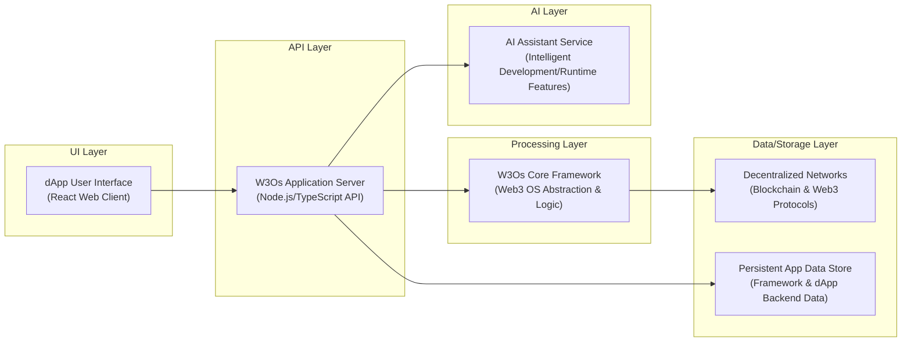

# W3Os

## Overview
- Comprehensive framework designed to simplify decentralized application (dApp) development.
- Provides an operating system-like abstraction for interacting with Web3 ecosystems.
- Offers a suite of tools and standardized components for building robust dApps.
- Aims to reduce complexity and accelerate development cycles for blockchain solutions.

## Business Problem
- dApp development is complex due to fragmented protocols and varying blockchain interfaces.
- Lack of a unified framework increases development time and leads to inconsistent user experiences.
- Interoperability between different blockchain networks and services presents a significant challenge.
- High barrier to entry for developers new to Web3, hindering innovation and adoption.

## Key Capabilities
- Decentralized Identity Management for secure user authentication.
- Simplified Smart Contract Abstraction Layer for diverse contracts.
- Cross-Chain Communication Toolkit facilitating seamless data and value transfer.
- Integration with decentralized storage systems like IPFS and Arweave.
- Real-time Blockchain Event Subscriptions for efficient monitoring.
- Comprehensive Developer CLI and SDK for rapid prototyping.
- Support for various Web3 wallet integration services.
- Modular Component Library for reusable dApp functionalities.

## Tech Stack
- Cloud: Cloud-agnostic deployment patterns
- Backend: TypeScript, Node.js, GraphQL
- Frontend: TypeScript, React
- Data: IPFS, Arweave, PostgreSQL
- AI/ML: N/A

## Architecture Flow
1. User interacts with a dApp frontend built using W3Os components.
2. Frontend calls W3Os SDK methods to perform Web3 operations.
3. W3Os SDK handles authentication, wallet interactions, and request signing.
4. SDK routes requests to appropriate smart contracts on the blockchain or decentralized storage.
5. Blockchain network executes contract logic, or decentralized storage returns data.
6. W3Os SDK receives transaction confirmations or data.
7. SDK processes responses and propagates results back to the frontend.

## Repository Structure
```
.
├── src/
│   ├── core/
│   ├── modules/
│   ├── contracts/
│   └── index.ts
├── examples/
├── docs/
├── tests/
├── scripts/
├── .github/
├── package.json
├── tsconfig.json
└── README.md
```

## Local Setup
1. Clone the repository: `git clone https://github.com/ramamurthy-540835/w3os.git`
2. Navigate to the project directory: `cd w3os`
3. Install dependencies: `npm install`
4. Build the project: `npm run build`
5. Run tests: `npm test`
6. Explore examples: `npm run start:example`

## Deployment
1. Ensure all tests pass: `npm test`
2. Build the production-ready distribution: `npm run build`
3. Publish to NPM (for library distribution): `npm publish`
4. Deploy smart contracts to chosen blockchain networks.
5. Deploy frontend application to a static hosting service or IPFS.
## Architecture

W3Os: Decentralized Application (dApp) Development Framework with Web3 OS Abstraction.



For a standalone preview, see [docs/architecture.html](docs/architecture.html).

### Key Architectural Aspects:
* W3Os provides a comprehensive framework to simplify decentralized application (dApp) development by abstracting Web3 complexities.
* It features a React-based user interface interacting with a Node.js/TypeScript application server that leverages a core 'Web3 OS' framework.
* The core framework orchestrates interactions with various blockchain networks and other decentralized Web3 protocols.
* An integrated AI Assistant service potentially aids in dApp development, provides intelligent features, or offers runtime assistance.
